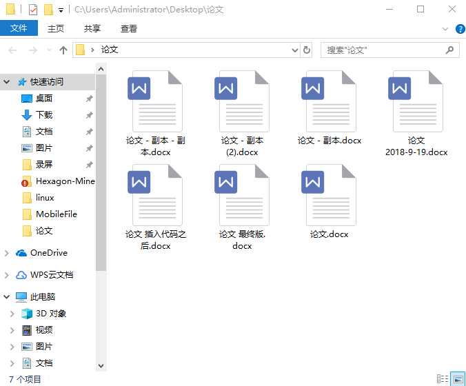

# 调研报告 - 分布式word文档版本管理

## 目录

[TOC]

## 小组成员

- 赵建博 PB16001750
- 伊昕宇 PB16001749
- 班泰瑜 PB16001724

## 项目背景

在当前 office 文档编辑软件普及的背景下，我们每天都在用着 office 办公软件，虽然文档编辑软件有了，但是在文档管理方面却缺少与之相应的软件来服务，我们从此入手，计划做一个 **word 文档的分布式版本库管理软件**。
### 什么是版本管理

用一个很简单的例子说明：大家在用 Microsoft Word 写文章时，有时想删除一个段落，或者修改一些内容，但又怕修改之后不满意想恢复成原来的样子，如果找不回来怎么办？我们常用的方法是，先把当前文件另存为一个新的 Word文件，再接着改，改到一定程度再另存为一个新文件，如此下去，我们有了越来越多的 word 文档，如图：

过了一段时间，文件越来越多，看着很糟糕，我想保留最新的一个，把其他的删掉，又怕将来会用上，还不敢删。想找回某一个版本，但是已经记不清保存在哪个文件里了，只好一个一个文件打开查找，真麻烦！

有时我们希望其他人帮我们写一些内容，我们把文件发过去，他们修改完之后发了回来，我们希望快速比较这两个文件的区别，把两个文件合并，而事实上我们通常同时打开两个文件，一边对比一边苦恼于别人修改了什么位置，真麻烦！

如果有一个软件，不但能自动帮我记录每次文件的改动，还可以让同事协作编辑，这样就不用自己管理一堆类似的文件了，也不需要把文件传来传去。如果想查看某次改动，只需要在软件里看一眼就可以，岂不是很方便？

于是我们有了版本管理软件（例如 git），而这些版本控制系统只能跟踪**文本文件**的改动，Word格式是**二进制**格式，不能用 git 很好的管理，而 word 文档又非常实用，我们迫切的需要一个 word 文档的版本管理工具。

### 什么是分布式

先说**集中式版本控制系统**，版本库是集中存放在中央服务器的，而干活的时候，大家用的都是自己的电脑，所以要先从中央服务器取得最新的版本，然后开始工作。干完活了，再把自己的活推送给中央服务器。这样就不可避免的产生很多问题：这个版本管理系统必须联网才能正常工作，会受到网络带宽的影响，对于庞大的版本库很不友好。而集中式版本控制系统的中央服务器如果出了问题，会影响到所有人。

**分布式版本控制系统**与集中式版本控制系统有何不同呢？首先，分布式版本控制系统根本没有“中央服务器”，每个人的电脑上都是一个完整的版本库，每个人修改文件之后，只需把各自的修改推送给对方，就可以互相看到对方的修改了。因此，工作的时候不需要联网，因为版本库就在你自己的电脑上，每个人电脑上都有一个完整的版本库。某一个人的电脑坏掉了不要紧，随便从其他人那里复制一个就可以了，相比集中式版本控制系统更加安全。

在实际使用分布式版本控制系统的时候，其实很少在两人之间的电脑上推送版本库的修改。因此分布式版本控制系统通常也有一台充当“中央服务器”的电脑，但这个服务器的作用仅仅是用来方便“交换”大家的修改，没有它大家也一样干活，只是交换修改不方便而已。

### 什么是 git

git 是一个**分布式版本管理工具**。从一般开发者的角度来看，git有以下功能：

1. 从服务器上克隆完整的Git仓库（包括代码和版本信息）到单机上。
2. 在自己的机器上根据不同的开发目的，创建分支，修改代码。
3. 在单机上自己创建的分支上提交代码。
4. 在单机上合并分支。
5. 把服务器上最新版的代码fetch下来，然后跟自己的主分支合并。
6. 生成补丁（patch），把补丁发送给主开发者。
7. 看主开发者的反馈，如果主开发者发现两个一般开发者之间有冲突（他们之间可以合作解决的冲突），就会要求他们先解决冲突，然后再由其中一个人提交。如果主开发者可以自己解决，或者没有冲突，就通过。
8. 一般开发者之间解决冲突的方法，开发者之间可以使用pull 命令解决冲突，解决完冲突之后再向主开发者提交补丁。

从主开发者的角度（假设主开发者不用开发代码）看，git有以下功能：
1. 查看邮件或者通过其它方式查看一般开发者的提交状态。
2. 打上补丁，解决冲突（可以自己解决，也可以要求开发者之间解决以后再重新提交，如果是开源项目，还要决定哪些补丁有用，哪些不用）。
3. 向公共服务器提交结果，然后通知所有开发人员。

git 优点：

1. 适合分布式开发，强调个体。
2. 公共服务器压力和数据量都不会太大。
3. 速度快、灵活。
4. 任意两个开发者之间可以很容易的解决冲突。
5. 离线工作。

git 缺点：
1. 学习周期相对而言比较长。
2. 不符合常规思维。
3. 代码保密性差，一旦开发者把整个库克隆下来就可以完全公开所有代码和版本信息。
4. 不能很好的管理二进制文件

我们要做的软件就是类似 git 的一个分布式版本库管理软件，git 仅支持对文本文件进行版本管理，但是二进制文件的管理并没有得到很好支持。为了给用户提供更大的方便，我们的软件准备对 word文档和文本文件同时做版本管理，其中文本文件的管理将会借助 git 来实现，docx 的管理将由我们自己实现，让人们可以像使用 git 一样轻松的对 docx 文件进行管理。同时我们预计划实现远程版本库相应功能，建立一个远程服务器来存储用户数据，方便版本库的交换于同步。

## 需求分析

### 个人需求

* git 虽然是一个功能强大的版本管理器，但是不支持对二进制格式文件的管理，而对于大多数人来说，我们常用的办公文件是 word 文档，其生成的文档是以二进制的形式存储的。如果能对 word 文档进行版本管理，对于不会使用 md 的人来说是一件非常方便的事情。
* 我们有时在更改一个 word 文档时，需要同时保留原文档的内容，这样的话需要新建一个文档，并且会出现相似的文件名，容易造成混淆，而且想要找到需要编辑的文档也很浪费时间，如果有一个版本管理器的话，对于一个文件就可以在版本管理器中保存每次修改的记录，并且可以记录每次修改时的信息，便于找到相应的版本。
* 在有些工作完成以后，可能需要在之前某个阶段的 word 文档作为某个模板，但此时之前的文档已经被修改无法挽回，每次修改都另存为文档的话会似的整个工作目录凌乱不堪，因此就需要一个版本管理器来记录每次修改的版本以及相关信息，如果需要之前某个阶段的工作文档的话，可以自由切换版本，从而保持整个工作目录的整洁条理。
* 当我们每次对文档进行没有什么把握的修改时，是不是都提心吊胆？生怕自己保存之后无法回到之前的版本，有了版本管理器之后，就再也不用担心这种问题，只要在修改之前保存当前的版本，即使发生了一些致命的错误也可以无压力的返回上一个版本，甚至完成后，想要看一看自己工作过程中遇到的问题，还可以切换回相应的失败版本，在历史文档之间自由的穿梭，就是一件这么美滋滋的事情。
### 团队需求

- 团队协作是一件很重要的事情。一个团队在写论文、报告时离不开 word 文档。每个人都有不同的分工，负责写不同的部分，最后组合成一个完整的文档。而一个论文一般是上下联系的，这就不可避免的使团队成员之间频繁的交换版本，交流进度，每次文档的修改都要手工合并，十分麻烦。

- 设想这样的一种情景：成员 C 刚刚修改好自己负责的 C 部分，这时收到了成员 A 向所有人分发的更新文档（A部分被更新），同时收到了成员 B 向所有人分发的 B 部分被更新后的文档。

  - C 可能觉得很麻烦，直接把自己的 word 文档分发出去（带有未更新的A 、B部分和更新后的 C 部分）。
  - C 也可能手工合并了这些更新并分发出去最新的文档（带有更新后的A、B、C部分）。

  因为成员之间频繁的交换版本，导致每个人手中的文档都是部分新，部分旧，谁也无法更新到最新的状态，因此他们之间也无法同步。为了解决这个困扰，他们必须设置一些”协议“：

  - 一旦收到别人发来的更新，立即同步到自己的 word 文档版本中。比如 A 给成员 B ~ G 分发了自己的更新，这时 B ~ G 每个人都要将更新手动同步，造成 6 倍的工作量，做了很多无用功。
  - 选一个人，所有人都把更新发给他，由他来同步最新的版本。这也不是一个好主意，这时整个团队的文档完全由一个人控制，他的失误会造成很大损失，而且很不放方便。

- word 文档的多人在线编辑工具看起来很好，但是团队成员无法同时在线，每个人有每个人的工作时间和安排，但他们又想像多人在线编辑一样时刻保持这手中 word 文档版本时刻处于最新状态，而且可以在各个版本中切换。

- 他们希望有一个软件，可以帮助团队解决文档的合并问题，他们想轻松的读出来两个版本之间的差别，并且时刻保持他们手中的文档是最新的，每个人手里的版本是同步的。最好能避免文件分发、手工合并带来的困扰。所以团队很需要一个 word 文档分布式版本管理软件。

## 重要性分析

### 安全需要

WannaCry（又叫Wanna Decryptor），一种“蠕虫式”的勒索病毒软件，大小3.3MB，由不法分子利用NSA（美国国家安全局）泄露的危险漏洞“EternalBlue”（永恒之蓝）进行传播。勒索病毒肆虐，这是一场全球性互联网灾难，给广大电脑用户造成了巨大损失。当时统计数据显示，至少150个国家、30万名用户中招，造成损失达80亿美元，已经影响到金融，能源，医疗等众多行业，造成严重的危机管理问题。中国部分Windows操作系统用户遭受感染，校园网用户首当其冲，受害严重，大量实验室数据和毕业设计被锁定加密。部分大型企业的应用系统和数据库文件被加密后，无法正常工作，影响巨大。

这只是一个”小例子“，这个病毒加密了很多大学生的毕业论文文档，并且必须付款解密，让许多没有备份文档习惯的大学生欲哭无泪。而平时的生活中有各种各样的病毒随时可能加密、损坏、修改我们的 word 文档，也有很多人有意或无意间破坏、删除了我们的 word文档。有了分布式 word 文档版本管理工具，可以很大程度上降低这种破坏发生的可能性，我们可以轻松恢复版本，这也是分布式文件的优越之处。

经常备份文件也可以在很大程度上保证信息安全，但对于经常修改的 word 文档，每次都登录百度云之类的软件上传文档、删除旧文档，这种手动管理版本是一件很麻烦的事情，况且需要联网。由此可以看出对于 word 文档的分布式版本管理工具的重要性。

### 工作需要

- 老师上课时打开课件，突然发现这不是昨天晚上熬夜修改的课件，早上匆忙没仔细看文件名，u盘中的课件是旧版！
- 离开电脑时忘记锁屏，辛辛苦苦写的文档被人恶意修改，保存退出，无法撤销！

- 别人为我的文档做了修改，我不知道他修改了什么位置 / 他修改的地方用特殊颜色标记，我需要手动调整。
- 我需要记录我们天的工作，记录每次 word 文档变更的原因。
- 我们团队需要异步、合作地编写文档。
- ...

word 文档版本管理和分布式管理在工作上也很重要！它不仅仅是一个便利的工具，可以提高我们的工作效率，更可以减少因为不同版本引起的失误，将误删、误修造成的损失降到最低，使工作更调理、有序化，使团队合作更方便、快捷。

## 立项依据

### git 的工作方式

git 是一个分布式版本管理工具，工作总共分四层，其中三层是在自己本地，即 git 仓库，包括工作目录、暂存区和本地仓库。第四层属于远程，即远程仓库，不是必须的。

工作目录就是我们执行一切文件操作的地方；暂存区和本地仓库都是在 `.git` 目录下，只用来存数据；远程仓库在中心服务器，也就是我们做好工作之后推送到远程仓库，或者从远程仓库更新下来最新代码到本地。

git 所存储的都是一系列的文件快照，git 来跟踪这些文件快照，发现哪个文件快照有变化就会提示你需要添加到暂存区或是提交到本地仓库来保证你的工作目录是干净的。

所以当我们在工作目录中进行文件操作后，要先添加到暂存区，然后再将暂存区中刚添加的文件快照提交到本地仓库，然后再将本地仓库的最新状态文件快照推送到远程仓库。

### git 对象

`.git/Objects` 文件夹中的文件是一个个的 git 对象，是38位的哈希值，这样就意味着没有两个相同的对象名。

从根本上讲，git是一套内容寻址的文件系统，它存储的是 key-value 键值对，然后根据 key 值来查找 value 。git也是根据指针来寻址的，这些指针就存储在git的对象中。git 一共有四种对象，commit 对象，tree 对象，blob 对象和 tag 对象，这里可以理解 tag 是 commit 的别名，下面便是这几个对象：

每个目录都创建了 “tree” 对象, 每个文件都创建了一个对应的 “blob” 对象，最后有一个 “commit” 对象来指向根 “tree” 对象，这样我们就可以追踪项目每一项提交内容。这个 blob 对象对应的就是文件快照中那些发生变化的文件内容，而 tree 对象则记录了文件快照中各个目录和文件的结构关系，它指向了被跟踪的快照，commit对象则记录了每次提交到本地仓库的文件快照。

在开发过程中，我们会提交很多次文件快照，那么第一次提交的内容会用一个 commit 来记录，这个 commit 没有指针指向上一个 commit 对象，因为他是第一个。当第二次提交时，又会有另外一个 commit 对象来记录，那么这次 commit 对象中就会有一个指针指向上一次提交后的 commit 对象，经过很多次提交后就会有很多的 commit 对象，它们组成了一个链表，当我们要恢复哪个版本的时候，只要找到这个 commit 对象就能恢复那个版本的文件。而我们所谓的 HEAD 对象其实就是指向最近一个提交的 commit 对象，也就是最后一个 commit 对象。

### docx 文档的读取

我们有很多方法读取 docx 文档，可以考虑直接读取 word 的二进制文件，或者先将 word 转换为其他格式进行读取。我们也可以试图利用 word 等软件提供的二次开发接口，利用编辑器读取 word 文档并进行编辑。

很多语言已经有了读取 word 文档相关的包，比如可以使用 c#，添加引用“COM”>“Microsoft Word xx.0 Object Library”，通过对动态链接库 Microsoft.Office.Interop.Word.dll 的调用，利用微软提供的相关类，对模板进行操作生成需要的文档。同时我们可以利用相关的接口实现 word 文档的比较、合并、冲突的修改等等。对于 java 语言，Apache POI 是一个 java 的读取 Microsoft 文档的接口。Apache POI 是创建和维护操作各种符合 Office Open XML（OOXML）标准和微软的 OLE 2 复合文档格式（OLE2）的 Java API。用它可以使用 Java 读取和创建，修改 MS Excel 文件。而且，还可以使用 Java 读取和创建 MS Word、和MS PowerPoint 文件。Apache POI 提供 Java 操作 Excel 解决方案（适用于Excel97-2008）。因此它主要实现对 Excel 文档的操作，对 word 的支持一般（新版 docx），不过也可以作为我们开发软件方式的一种选择。

我们也可以考虑先将 word 文档转换成其他易于读取的格式，如 markdown 或 xml，再利用这些文档进行 word 文档的分析。Pandoc 软件是由 John MacFarlane 开发的标记语言开源转换工具，使用 Haskell 语言编写，采用 GNU GPL 授权协议发布，属于自由软件。它可实现不同标记语言间的格式、常见的格式转换，支持多种操作系统，以命令行的方式实现与用户的交互。它就可以实现 word 到 markdown 的转换，可以帮助我们读取 docx 文件格式，我们也可以借鉴这个思路，即先把 word 转换为易于读取的格式，再进行管理。 

docx4j 是一个用于创建和操作 Microsoft Open XML (Word docx, Powerpoint pptx, 和 Excel xlsx) 文件的 Java 类库。我们也可以通过 java 语言来实现 docx 格式文件的读取，先将 docx 格式转化成 xml 这种格式的标记语言文档，然后来进行分析及信息提取。docx4j 需要 java 中的 JAXB 来支持。

### 我们的方式

实现 docx 文档的分布式版本管理有很多种方案可以选择。首先，管理方法上我们打算采用类似 git 的**版本管理方法**。git 的版本管理是一个很成熟的技术，我们可以借鉴 git 的工作原理和版本管理的方案开发我们的软件，这样同时也会使用户能快速的上手使用我们的版本管理软件。我们可能对其中一些细节作出修改，方便我们软件的编写，去掉一些 git 中复杂而又不是很常用的功能，在我们的能力范围内做好版本管理这一块。

其次，docx 文档是二进制文件，仅仅照搬 git 的管理方式必定无法实现我们的目标。为了能对非文本的 docx 文档很好的管理，我们必须选择一种适合的**读取 word 文档的方式**。我们调研了很多种读取 word 文档的方式，我们将权衡利弊，选择一种方便、有效、而又适合我们进行版本管理的方式，可能用 java、c#、或是 python 等，将 word 文档转换为便于管理的文件进行管理，或便于读取的文件进行读取，或者直接想办法读取 word 文档，实现分支的合并、冲突的解决、文件的比较等等。

然后，我们需要**实现分布式管理**。我们会借鉴 git 实现分布式管理的方式，学习 git 的工作原理，用某种传输协议来简单的实现我们 docx 文档的分布式管理。如果可能，我们会尝试搭建一个服务器方便文档的交换和同步，比如可以通过 java 语言通过 ssh 协议向我们的远程服务器推送 word 文档的修改或从服务器拉取最新的版本，实现分布式版本管理。

最后，考虑到有的用户可能同时对 docx 文档和其他文本文档做版本管理，如果我们同时实现对文本文档的版本管理，一是时间上不够，二是 git 已经在这方面做的很好，我们的实现没有太大的意义。如果我们只能支持管理 docx 文档，那用户就需要用两个工具同时管理 docx 和 其他文本文档，十分麻烦。所以我们设想为安装了 git 的用户提供一个选项，他们可以选择让我们的软件添加**对文本文档管理的支持**，但通过 git 实现，既简化了我们的项目，而且使用户可以更方便的同时管理 docx 和文本文档。为了对 git 用户友好，我们尽可能采用类似 git 的命令和方式开发我们的软件，保证熟悉 git 的用户可以快速上手。

如果有时间，我们还有很多**扩展的设想**：

- 增加对 windows 操作系统的支持，可能增加图形界面
- 增加对其他 Microsoft 文档管理的支持，即幻灯片或表格等
- 增加一些实用功能，比如将某个特定版本的 word 文档导出为 pdf
- 更加人性化的设计、更多个性化的功能 
- ...

## 相关工作

### Pandoc

Pandoc 是由 John MacFarlane 开发的标记语言转换工具，可实现不同标记语言间的格式转换，堪称该领域中的“瑞士军刀”。
Pandoc 使用 Haskell 语言编写，以命令行形式实现与用户的交互，可支持多种操作系统；Pandoc采用GNU GPL授权协议发布，属于自由软件。

Pandoc 支持的格式包括：

1. HTML格式：使用Slidy，reveal.js，Slideous，S5或DZSlides的XHTML，HTML5和HTML幻灯片。
2. Word处理器格式：Microsoft Word docx，OpenOffice / LibreOffice ODT，OpenDocument XML
3. 电子书：EPUB版本2或3，FictionBook2
4. 文档格式：DocBook，TEI Simple，GNU TexInfo，Groff手册页，Haddock标记
5. 页面布局格式：InDesign ICML
6. 大纲格式：OPML
7. TeX格式：LaTeX，ConTeXt，LaTeX Beamer幻灯片
8. 使用LaTeX编辑的PDF文档
9. 轻量级标记格式：Markdown（包括CommonMark），reStructuredText，AsciiDoc，MediaWiki标记，DokuWiki标记，Emacs组织模式，
10. 自定义格式：自定义作者可以用lua编写。

### docx4j

DOCX4J 是一个开放源代码（Apache V2 协议）java 库，用于创建、编辑和保存OpenXML“包”，包括DOX、PPTX和XSLX。它使用 JAXB 来创建 Java 表示。它的功能包括

1. 打开现有的DOXX/PPTX/XLSX
2. 创建新的DOXX/PPTX/XLSX
3. 以编程方式操纵DOXX/PPTX/XLSX（文件格式允许的任何内容）
4. 自定义XML绑定（支持图片、富文本、复选框、以及用于重复和条件以及导入XHTML的OpenDoPE扩展）
5. 导出为HTML
6. 作为PDF导出（使用PLUTEXT的PDF转换器，或使用DOXX4J导出项目）
7. 生成/消费Word 2007的XMLPACK（PKG）格式
8. 应用变换，包括通用滤波器
9. 字体支持（字体替换，以及嵌入在文档中的任何字体）
### Apache POI

开发中经常会设计到 excel 的处理，如导出 Excel，导入 Excel 到数据库中。Apache POI 是用 Java 编写的免费开源的跨平台的 Java API，Apache  POI 提供 API 给 Java 程式对 Microsoft  Office（Excel、WORD、PowerPoint、Visio等）格式档案读和写的功能，当然对 excel 有着很好的支持。POI为“Poor Obfuscation  Implementation”的首字母缩写，意为“可怜的模糊实现”。

Apache POI 中的 HWPF 类提供读写 Microsoft Word DOC97 格式档案的功能。XWPF 类提供读写 Microsoft Word DOC2003 格式档案的功能。在各种组件中目前只有用于操作 Excel 的 HSSF 相对成熟。

### word 自己的版本管理工具

word 功能栏添加自定义工具，有一个版本管理的按键。点击弹出版本管理侧边框，初始化、添加、打开、写入、删除功能。考虑到多个文档都需要有自己的 CustomTaskPane，所以侧边框的初始化在第一次点击版本管理时进行，大概会延迟1~2秒，也许可以提前初始化一个备用。CustomTaskPane的添加需要采用`CustomTaskPanes.Add(control，title ,  window)` 需要自定义放置的窗口。具体功能就是初始化、添加、打开、写入、删除。

  

- 初始化：当前文件位置新建同名文件夹作为版本的存储地方，TreeView 建立顶层节点。
- 添加：选择节点，在该节点下建立当前时间的节点，保存文档，复制该文档至版本文件夹内，名称为V+时间。没有采用saveas，因为saveas之后当前文件为另存为的那一份，文件位置改变了。
- 打开：就是打开文件
- 写入：将节点文件代替当前文件成为主版本。过程为  打开节点文件-关闭当前文件的侧边框-关闭当前文件-节点文件 saveas 主版本。其中关闭当前文件的侧边框是因为第二次写入会产生侧边框问题。注：写入不是文字内容覆盖，而是文件覆盖，所以写入之后原文件应该就无法找回了。
- 删除：删除节点，文件不改变。

利用Word本身的修订功能，把所有的历史修改都记录在word文档本身之中，打开修订查看修订过程，每个人的修改都可以看到。word 自己的版本管理工具并不是很好用，也缺少了很多功能，用起来很麻烦，所以并不常用，也没有几个人了解。

还有一些收费软件如 sharepoint 可以提供 word 的版本管理，但都不是很常用。

## 参考文献

1. git 的工作原理 https://blog.csdn.net/mayfla/article/details/78661718
2. 基于Git的分布式版本控制系统的设计与实现 https://www.xzbu.com/8/view-3788676.htm
3. git 简介 https://www.liaoxuefeng.com/wiki/0013739516305929606dd18361248578c67b8067c8c017b000/001373962845513aefd77a99f4145f0a2c7a7ca057e7570000
4. pandoc - about pandoc http://www.pandoc.org/
5. docx4j - JAXB-based Java library for Word docx, Powerpoint pptx, and Excel xlsx files https://www.openhub.net/p/docx4j
6. word 2013 版本管理 https://blog.csdn.net/lk1233691/article/details/75267830
7. best way to do version control for ms excel https://stackoverflow.com/questions/131605/best-way-to-do-version-control-for-ms-excel
8. Why is version control important https://www.perforce.com/solutions/version-control
9. Apache POI - the Java API for Microsoft Documents http://poi.apache.org/
10. Apache POI 使用详解 https://blog.csdn.net/vbirdbest/article/details/72870714
11. Semantic-based Distributed Version Control Model https://www.researchgate.net/publication/314641372_Semantic-based_Distributed_Version_Control_Model